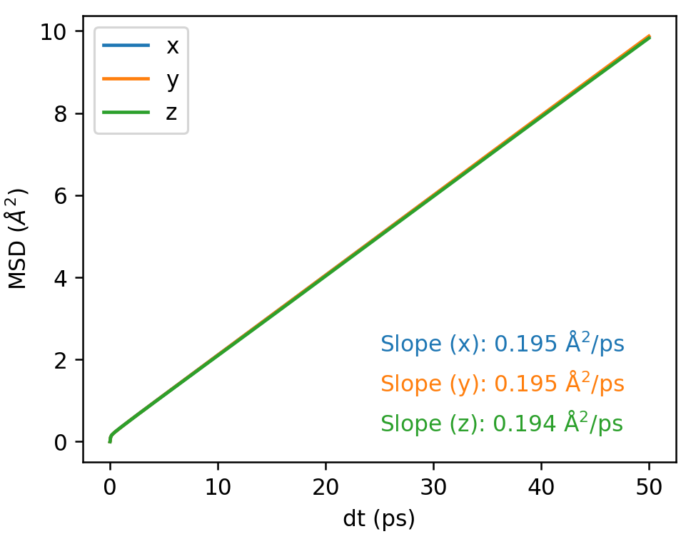
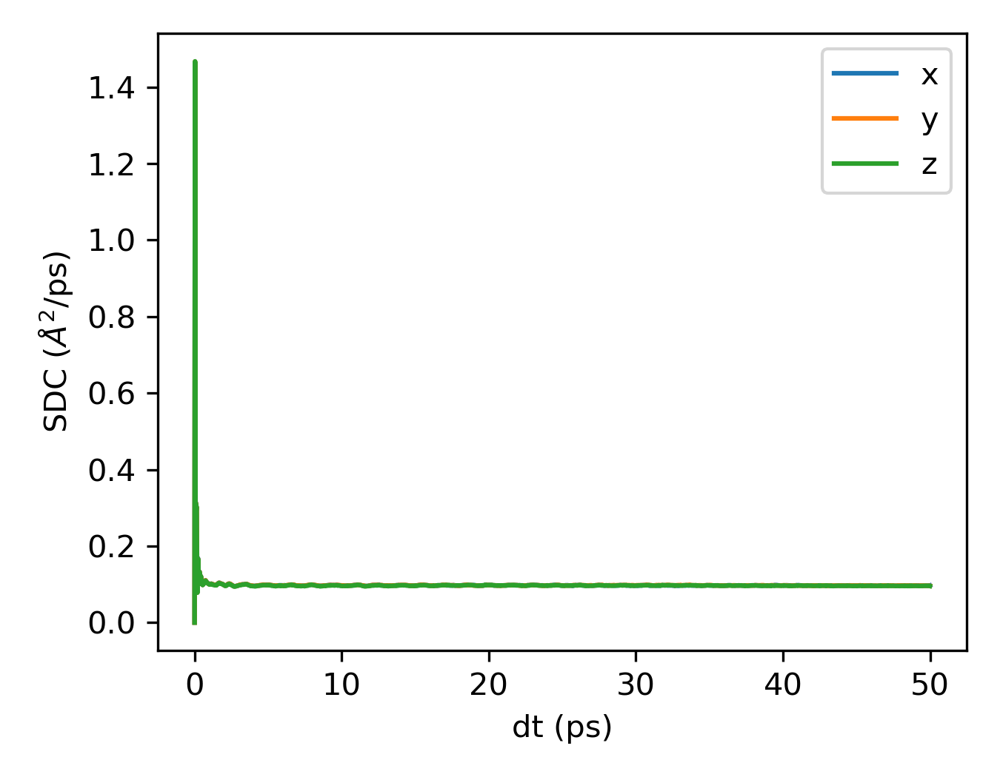
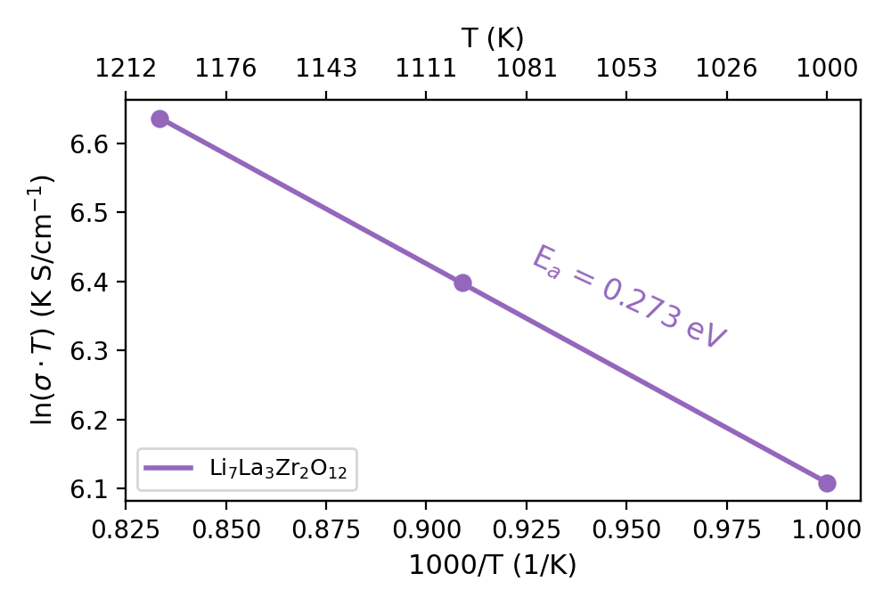

# Ionic Conductivity Calculations

This tutorial demonstrates how to calculate the ionic conductivity of lithium ions (Li<sup>+</sup>) use the `GPUMD` package. We will use the garnet-type Li<sub>7</sub>La<sub>3</sub>Zr<sub>2</sub>O<sub>12</sub> (LLZO), a well-known solid electrolyte, as our model system. You will learn how to:

- Compute the mean squared displacement (MSD) of Li<sup>+</sup> ions.
- Derive the diffusion coefficient from MSD data.
- Convert the diffusion coefficient to ionic conductivity using the Nernst-Einstein relation.
- Estimate the activation energy of Li<sup>+</sup> diffusion.

### Setup and Resources

To follow this tutorial, you will need the following:

- **Input Structure**: `model.xyz` file for the cubic LLZO (c-LLZO).
- **Potential File**: a well-trained NEP (`nep.txt`) for the c-LLZO system. 

In this tutorial, I provide the `NEP25-ZBL` model trained in our previous work [1], which is a NEP trained with only 25 configurations and successfully describes various properties of LLZO, including phase transitions, atomic local environments, and ionic diffusion properties. For more details, refer to [SourceFiles]([zhyan0603/SourceFiles: Source Files of My Publications](https://github.com/zhyan0603/SourceFiles)) and [arXiv:2504.15925]([ https://doi.org/10.48550/arXiv.2504.15925](https://doi.org/10.48550/arXiv.2504.15925)).

### Step 1: Simulation Setup

Here is an example input file for performing the simulation at 1000K:

```
potential ../nep.txt
velocity    1000

ensemble    npt_mttk temp 1000 1000 aniso 0 0
run        50000

ensemble    npt_mttk temp 1000 1000 aniso 0 0
compute_msd 10 5000 group 0 0
dump_thermo 100
dump_exyz 1000000
run        1000000
```

#### Explanation of Input Parameters

- `potential ../nep.txt`: Specifies the NEP file for LLZO.
- `velocity 1000`: Initializes atomic velocities at 1000 K.
- `ensemble npt_mttk temp 1000 1000 aniso 0 0`: Uses the NPT ensemble with the Martyna-Tuckerman-Tobias-Klein thermostat and barostat at 1000 K.
- `run 50000`: Performs a 50 ps equilibrium run.
- `compute_msd 10 5000 group 0 0`: Calculates the MSD of Li<sup>+</sup> ions (group 0). The position data will be recorded every 10 steps, and the maximum number of correlation steps is 5000. See [here](https://gpumd.org/gpumd/input_parameters/compute_msd.html) for details of `compute_msd` command.
- `dump_thermo 100`: Outputs thermodynamic properties to thermo.out every 100 fs.
- `dump_exyz 1000000`: Saves the final configuration as an extxyz file.
- `run 1000000`: Performs a 1 ns production run.

### Step 2: Calculating and Visualizing MSD

The MSD quantifies the average distance traveled by Li<sup>+</sup> ions over time, a key quantity for calculating ionic diffusivity. The MSD is calculated using the relation:
$$
\text{MSD}(t) = \frac{1}{N} \sum_{i=1}^N \left\langle \left| \mathbf{r}_i(t) - \mathbf{r}_i(0) \right|^2 \right\rangle
$$
- $\mathbf{r}_i(t)$ is the position of ion (i) at time (t).
- $\mathbf{r}_i(0)$ is the initial position of ion (i).
- $N$ is the number of Li⁺ ions.
- $\left\langle \  \right\rangle$ denotes the time average.
- $\frac{1}{N}\sum_{i=1}^N$ denotes the averages over all Li⁺ ions.

After running the simulation, `GPUMD` generates an `msd.out` file containing the MSD data for Li$^+$ ions. See [here](https://gpumd.org/gpumd/output_files/msd_out.html#msd-out) for details of `msd.out` file.

#### Visualizing MSD

The `msd.out` file contains the [MSD](https://gpumd.org/glossary.html#term-MSD) and self diffusion coefficient ([SDC](https://gpumd.org/glossary.html#term-SDC)).

The data in this file are organized as follows:

- **column 1:** correlation time (in units of ps)
- **column 2:** MSD (in units of Å2) in the x direction
- **column 3:** MSD (in units of Å2) in the y direction
- **column 4:** MSD (in units of Å2) in the z direction
- **column 5:** SDC (in units of Å2/ps) in the x direction
- **column 6:** SDC (in units of Å2/ps) in the y direction
- **column 7:** SDC (in units of Å2/ps) in the z direction

You can use any software to visualize the data, here I recommend the [plt_msd.py](https://github.com/zhyan0603/GPUMDkit/blob/main/Scripts/plt_scripts/plt_msd.py) and [plt_sdc.py](https://github.com/zhyan0603/GPUMDkit/blob/main/Scripts/plt_scripts/plt_sdc.py) script, which is integrated into the [GPUMDkit](https://github.com/zhyan0603/GPUMDkit) package and can be called with the following command:

```
gpumdkit.sh -plt msd/sdc
```

then you will see:

<div align="center">
    
    
</div>

### Step 3: Calculate Diffusion Coefficient

The **<u>diffusion coefficient (D)</u>** measures the rate of Li$^+$ ion diffusion in LLZO, a critical step toward calculating ionic conductivity. It is derived from the MSD using the Einstein relation:
$$
D = \frac{1}{2N} \lim_{t \to \infty} \frac{d}{dt} \text{MSD}(t)
$$

where:

- $N$ is the number of dimensions (e.g., (N = 3) for 3D diffusion in LLZO.
- $\frac{d}{dt} \text{MSD}(t)$ is the slope of the MSD versus time in the diffusive regime, where MSD grows linearly.

The `msd.out` file provides the time (in ps) and MSD components (in Å$^2$). We can fit a straight line in the linear region to obtain the slope (k) (in Ų/ps) and convert the slope to the diffusion coefficient in unit of cm$^2$/s using: 
$$
D = \frac{k}{2N} \times 10^{-4}
$$

### Step 4: Compute Ionic Conductivity

Next, you can calculate the ionic conductivity ($\sigma$) from the diffusion coefficient (D) using the **<u>*Nernst-Einstein*</u>** relation:
$$
\sigma = \frac{n q^2 D}{k_B T}
$$
Where:

- $n$ is the number density of ions
- $q$ is the elementary charge
- $D$ is the diffusion coefficient
- $k_B$ is the Boltzmann constant
- $T$ is the temperature

For LLZO, you need the number density ($n$), which depends on the number of Li$^+$ ions and the cell volume.

- Count the number of Li$^+$ ions ($N_\text{ion}$) in your `model.xyz` file. Herein, we use a $4\times4\times4$ supercell of LLZO with 3584 Li$^+$ ions.
- Obtain the average volume ($V$) (in Å$^3$) from the `thermo.out` file. Convert to $cm^3$ (Å$^3 = 10^{-24}\text{cm}^3$).
- $n = \frac{N_\text{ion}}{V}$ (in $cm^{-3}$).

#### Calculate D and $\sigma$ by GPUMDkit

In fact, the `function 401` in [GPUMDkit](https://github.com/zhyan0603/GPUMDkit) can be used to calculate $\sigma$ easily. You only need to specify the element and charge, then you will get the following results:

```
 Number of ions: 3584
 Average Volume: 143800.291 Å^3
 Average Temperature: 999.928 K
 ------------------------------
 Diffusivity (D):
   D_x: 9.717e-06 cm^2/s
   D_y: 9.724e-06 cm^2/s
   D_z: 9.665e-06 cm^2/s
   D_total: 9.702e-06 cm^2/s
 ------------------------------
 Ionic Conductivity:
   Sigma_x: 4.503e+02 mS/cm
   Sigma_y: 4.506e+02 mS/cm
   Sigma_z: 4.479e+02 mS/cm
   Sigma_total: 4.496e+02 mS/cm
 ------------------------------
```

The script reads the `model.xyz` and `thermo.out` files, calculating the `number of ions`, `average volume`, and `average temperature`. If these two files do not exist, you will be asked to enter these parameters manually. Finally, it will output the $D$ and $\sigma$ like the above one.

### Step 5: Determining the Activation Energy

The activation energy ($E_a$) represents the energy barrier for Li$^+$ ion diffusion. It is determined by analyzing the temperature dependence of ionic conductivity using the Arrhenius equation: 
$$
\sigma T = A \exp\left(-\frac{E_a}{k_B T}\right)
$$
where:

- $\sigma$: Ionic conductivity
- $T$: Temperature
- $A$: Pre-exponential factor
- $E_a$: Activation energy
- $k_B$: Boltzmann constant

Taking the natural logarithm:
$$
\ln(\sigma T) = \ln A - \frac{E_a}{k_B T}
$$
Plotting $\ln(\sigma T)$ versus $\frac{1}{T}$ yields a straight line, where the slope is $-\frac{E_a}{k_B}$. Alternatively, using $\frac{1000}{T}$ (in $ K^{-1}$) is common, giving a slope of $-\frac{E_a}{k_B \cdot 1000}$. The activation energy is then:
$$
E_a = -\text{slope} \cdot k_B \cdot 1000
$$
I provide a `plt_arrhenius.py` script for reference only, and you will get the following figure:

<div align="center">
    
</div>

The calculated activation energy of c-LLZO is in good agreement with the literature [2].


#### References

[1] Zihan Yan, Zheyong Fan and Yizhou Zhu, [Improving robustness and training efficiency of machine-learned potentials by incorporating short-range empirical potentials](https://doi.org/10.48550/arXiv.2504.15925), arXiv:2504.15925.

[2] Zihan Yan and Yizhou Zhu, [Impact of Lithium Nonstoichiometry on Ionic Diffusion in Tetragonal Garnet-Type Li$_7$La$_3$Zr$_2$O$_{12}$](https://doi.org/10.1021/acs.chemmater.4c02454), *Chem. Mater.* 2024, 36, 23, 11551–11557.